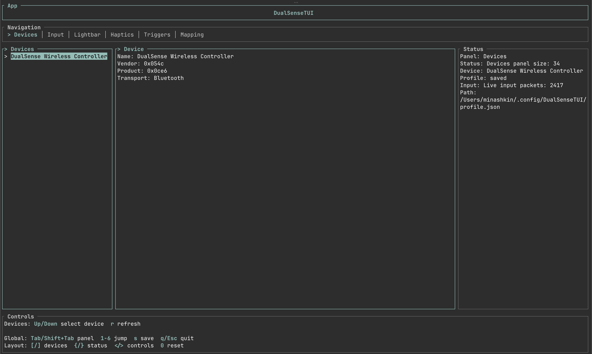
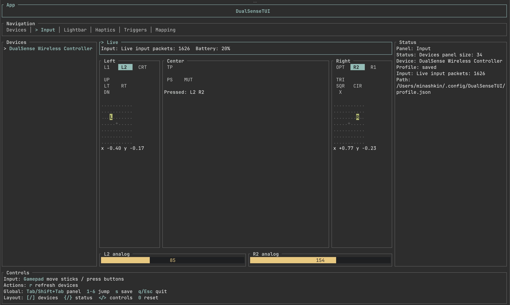
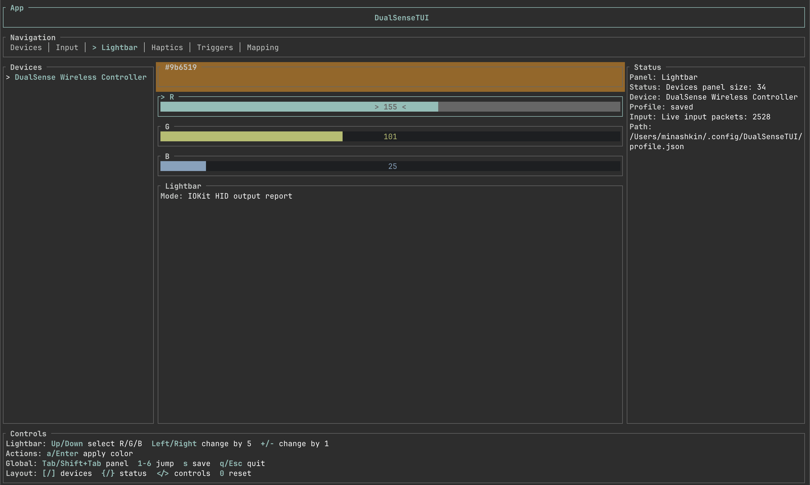
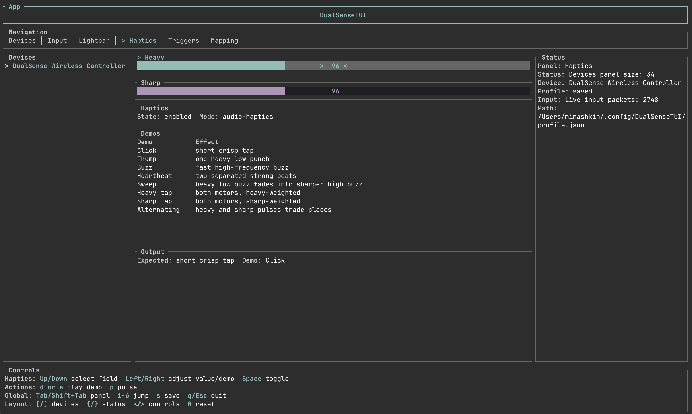
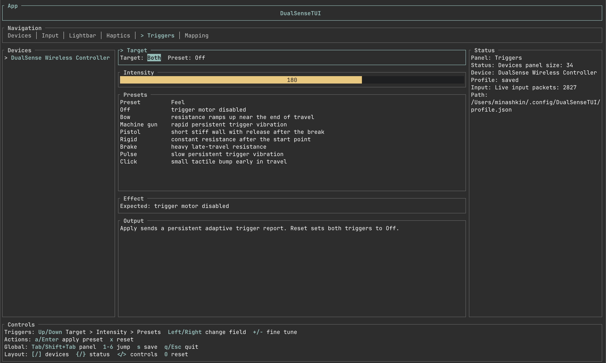
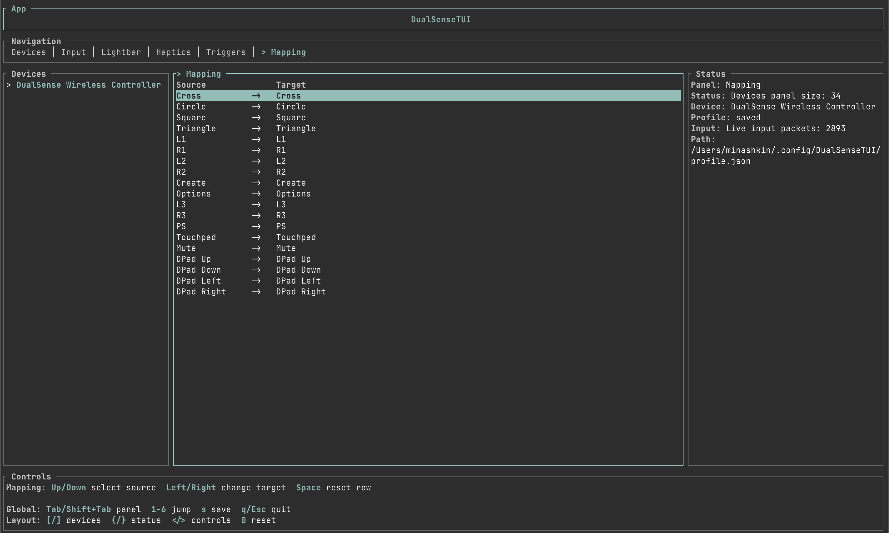

# DualSenseTUI

[](https://github.com/minashkinvladislav/DualSenseTUI/actions/workflows/ci.yml)
[](https://github.com/minashkinvladislav/DualSenseTUI/actions/workflows/release.yml)
[](https://github.com/minashkinvladislav/DualSenseTUI/releases)


Native macOS configurator for DualSense, with a SwiftUI desktop app and an advanced Ratatui console.

## Features

- Native SwiftUI desktop app for everyday configuration, live input, profiles, mappings, mouse output, and background mode.
- `ratatui` console retained for advanced workflows and terminal-first development.
- macOS IOKit HID backend with manager-owned input and hot-plug callbacks. No SDL2 runtime is required.
- USB output report `0x02` and Bluetooth output report `0x31`, including CRC32 diagnostics for Bluetooth frames.
- Live input view for buttons, analog triggers, sticks, two touch contacts, six-axis motion, battery, headset, and microphone status.
- DualSense Edge detection with Fn and rear-paddle button input.
- Device diagnostics from pairing and firmware feature reports: MAC address, hardware version, firmware version, and feature level.
- Symmetric haptics demos: click, thump, buzz, heartbeat, sweep, impact, tap, and pulse train.
- Opt-in audio-reactive haptics from macOS system audio on macOS 14.2 or later.
- Adaptive trigger presets: bow, machine gun, pistol, rigid, brake, pulse, and click; plus configurable resistance and vibration modes.
- Player LEDs, mute LED/microphone state, controller-speaker level, microphone level, and HID audio-route controls.
- Optional keyboard and mouse output mappers for macOS apps, with explicit Accessibility permission and reliable key/button-up handling.
- Per-controller JSON profiles keyed by pairing MAC address, with backward-compatible fallback to `~/.config/DualSenseTUI/profile.json`.
- Reusable named profiles in the desktop app, with explicit load, save-to-library, and restore-defaults actions.
- Optional per-user LaunchAgent that keeps profiles applied after reconnect without opening the terminal UI.

## Screenshots

<table>
  <tr>
    <td align="center">
      
      <br>
      <sub>Devices</sub>
    </td>
    <td align="center">
      
      <br>
      <sub>Live input</sub>
    </td>
  </tr>
  <tr>
    <td align="center">
      
      <br>
      <sub>Lightbar</sub>
    </td>
    <td align="center">
      
      <br>
      <sub>Haptics</sub>
    </td>
  </tr>
  <tr>
    <td align="center">
      
      <br>
      <sub>Adaptive triggers</sub>
    </td>
    <td align="center">
      
      <br>
      <sub>Button mapping</sub>
    </td>
  </tr>
</table>

## Install

### Desktop App (Recommended)

Download `DualSenseTUI-<version>-universal.dmg` from a release, open it, and drag `DualSenseTUI.app` into `Applications`. Then launch it normally from Applications or Spotlight. The desktop app supports macOS 13 or later and contains both Apple Silicon and Intel binaries.

The first launch does not need Terminal. The app asks for Accessibility only when keyboard or mouse output is enabled, and opens the correct System Settings pane when macOS needs the user to confirm the permission.

### Local Desktop Build

The native app requires full Xcode, not only Command Line Tools:

```bash
scripts/run-macos-app.sh
```

This builds `target/gui/debug/DualSenseTUI.app`, embeds the Rust controller service, signs it with an available local identity, and launches the app.

### Advanced Terminal Console

The original terminal interface remains available for development and advanced workflows:

```bash
cargo run
```

On macOS, `cargo run` creates `target/debug/DualSenseTUI.app`, then runs its inner terminal executable. The app bundle has a stable identifier, which keeps the Accessibility permission valid across rebuilds when it is signed with an Apple Development or Developer ID identity.

For reliable local event-posting access, install full Xcode, sign in with an Apple Account, and create an `Apple Development` certificate in Xcode Settings > Accounts > Manage Certificates. The runner selects an Apple Development or Developer ID Application identity automatically; set `DUALSENSE_TUI_CODESIGN_IDENTITY` to use a specific one. With Command Line Tools only, the runner warns and uses ad-hoc signing, which is not a reliable TCC permission path for keyboard or mouse output.

For an optimized terminal build:

```bash
cargo run --release
```

To request and inspect mouse/keyboard event-posting access without opening the HID backend:

```bash
cargo run -- --request-event-posting-access
```

## Persistent profiles and background mode

Press `s` while a controller is selected to save its profile. When the controller exposes its pairing MAC address, the profile is written to:

```text
~/.config/DualSenseTUI/profiles/aa-bb-cc-dd-ee-ff.json
```

The legacy `~/.config/DualSenseTUI/profile.json` remains a global fallback for existing installations and for controllers whose MAC address is unavailable. On startup and after a USB/Bluetooth reconnect, DualSenseTUI waits briefly for the device and reapplies the saved lightbar, adaptive-trigger, and system-control settings once. Haptics demos are never replayed automatically.

The desktop app's **Profiles** screen also has a separate named profile library at:

```text
~/.config/DualSenseTUI/saved-profiles/
```

Enter a name and choose **Save to Library** to preserve the current configuration as a reusable preset. The automatic controller profile and the reusable library are intentionally separate, so an empty library does not mean the controller profile is missing. Select a reusable profile later and use **Load Library Profile** to apply it to the current controller. Loading a named profile, or using **Restore Defaults**, marks the controller profile as unsaved; use **Save for Controller** to make that state auto-apply after reconnect.

Applying a Lightbar color writes that color to the controller profile immediately, without committing unrelated staged settings. By default, **Keep color when app is inactive** reasserts the current color every two seconds while the app is inactive; disable it before using software that manages the controller lightbar itself.

### Install the background agent

In the desktop app, open **Profiles** and enable **Keep mappings active in background**. First move the app to `/Applications`, because the service records its absolute executable path. The app installs and loads the per-user service without requiring `sudo`. Manage a released desktop app's agent from this screen rather than by invoking its internal helper from Terminal.

The terminal console has its own development fallback. First configure a controller in the TUI and press `s`, then install its agent from Terminal:

```bash
target/debug/DualSenseTUI.app/Contents/MacOS/DualSenseTUI --install-agent
```

No `sudo` is required. Installation writes the per-user plist at:

```text
~/Library/LaunchAgents/com.github.minashkinvladislav.dualsensetui.autostart.plist
```

and immediately registers it with `launchd`. The agent starts `DualSenseTUI --daemon` now and at future logins; `RunAtLoad` and `KeepAlive` make it restart if it exits. The daemon has no terminal UI: it watches for DualSense connections and applies saved profiles after reconnect. You can close the Terminal after installation.

Verify that it is both installed and running:

```bash
target/debug/DualSenseTUI.app/Contents/MacOS/DualSenseTUI --agent-status
```

The output should show `installed: true` and `loaded: true`. To stop and remove it:

```bash
target/debug/DualSenseTUI.app/Contents/MacOS/DualSenseTUI --uninstall-agent
```

Re-enable the service after moving the app or replacing it at a different path, because the LaunchAgent records the executable path. The background process is still necessary for keyboard/mouse mappings; grant Accessibility permission to this app bundle first. A game can intentionally replace controller effects after it connects, and DualSenseTUI does not continuously overwrite game output.

## Advanced Terminal Controls

- `Tab` / `Shift+Tab`: switch panels
- `1`..`8`: open Devices, Input, Sensors, Lightbar, Haptics, Triggers, System, Mapping
- Arrow keys: move or adjust values
- `+` / `-`: fine tune the active numeric value
- `Space`: toggle the selected haptics/system state, start or stop audio-reactive haptics, play the selected haptics demo, or reset the selected mapping row
- `a` / `Enter`: apply lightbar, run the selected haptics action, apply triggers/system controls, or toggle the selected keyboard/mouse output view
- `p`: pulse haptics
- `d`: play the selected haptics demo
- `x`: reset adaptive triggers to Off from the Triggers tab
- `m`: switch between controller-profile, keyboard-output, and mouse-output mapping views
- `k`: toggle the active output mapping from the Mapping tab
- `o`: open macOS Accessibility settings from the Mapping tab
- `s`: save the selected controller profile
- `r`: refresh devices and schedule saved-profile reapplication
- `[` / `]`: shrink or grow the Devices panel
- `{` / `}`: shrink or grow the Status panel
- `<` / `>`: shrink or grow the Controls panel
- `0`: reset panel sizes
- `q` / `Esc`: quit

## Haptics

`Protocol` selects the DualSense haptic-v2 compatibility flag (`haptic-v2`) or the legacy compatibility flag (`legacy rumble`). It controls how the same two HID motor values are interpreted; it is not an audio source.

`Audio reactive` is a separate, opt-in system-audio feature for macOS 14.2+. Enable it in the desktop app's Haptics screen, or select it in the terminal Haptics panel and press `Space`. A native Core Audio Tap analyzes outgoing system audio locally; bass or higher-frequency detail raises one shared motor level. The app sends that same smoothed value to both motors and does not retain, save, route, or play audio through DualSense.

macOS asks for system-audio capture permission on the first start. Allow `DualSenseTUI.app` under **Privacy & Security → Screen & System Audio Recording**, then start it again if necessary. `Sensitivity` and `Noise gate` are saved in the controller profile, but capture never starts automatically after launch or reconnect. Stop the feature with `Space`; it also stops and sends zero motor output on a device change, refresh, error, or application exit.

DualSenseTUI sends identical HID values to the left and right motors for a manual pulse, every demo frame, and audio-reactive haptics. `Motor strength` is the shared maximum used by manual and audio-reactive output; older per-motor profile values are averaged on load and become a matching pair when the profile is next saved.

## Adaptive Triggers

The Triggers tab sends DualSense adaptive trigger effect blocks for L2, R2, or both triggers. Use the preset list to pick the feel, or choose `Resistance` and `Vibration` mode to set start/end positions and vibration frequency directly. Adjust intensity, then press `a` or `Enter` to apply.
`Machine gun` and `Pulse` use persistent trigger vibration mode and stay active until you apply another preset or press `x` to reset.

## Sensors And System

The Sensors tab exposes raw gyroscope and accelerometer values, report timestamp, touchpad contacts, and Bluetooth frame CRC status. The System tab applies player LEDs, mute state, controller-speaker/microphone levels, and a HID audio route. USB controller audio remains a separate CoreAudio endpoint managed by macOS; Bluetooth controller audio is not exposed by this backend.

## Mapping

`Controller profile` saves a deterministic button-to-button profile for software that can consume it. DualSense does not expose persistent firmware-level button remapping through the public HID output reports.

`Keyboard output` is a real user-space mapping backend for macOS. Configure it in **Mappings** in the desktop app, then enable the output. It requests the Core Graphics event-posting permission that keyboard and mouse output actually use. If access is missing, DualSenseTUI calls `CGPreflightPostEventAccess` and `CGRequestPostEventAccess`, then opens the Accessibility settings page. `PostEvent` is internally separate from broad Accessibility access even though macOS shows both in that page. Allow the currently running, signed `DualSenseTUI.app` bundle. A checkbox granted to Terminal, a bare executable, or a build signed by a different identity does not grant this app access. The terminal console exposes the same flow with Mapping, `k`, and `o`. Keep DualSenseTUI or its background service running and switch focus to the target app; disabled mappings and application exit release every synthesized key. It is not a virtual gamepad and does not suppress the original physical controller input.

After upgrading from a build made before app bundles, remove old `DualSenseTUI` entries from Accessibility once. Add `target/debug/DualSenseTUI.app`, not the bare executable inside `target/debug`.

### Mouse Output

`Mouse output` turns the DualSense into a macOS pointing device. Open **Mouse Control** in the desktop app, adjust pointer speed, dead zone, and scroll speed, then enable mouse control. If macOS has not granted event-posting access yet, use **Grant Accessibility** and **Open Settings**, enable the signed `DualSenseTUI.app` bundle, then enable mouse control again. The terminal console provides the same controls in Mapping (`8`) after switching to `Mouse output` with `m`.

Keep DualSenseTUI running, then switch focus to the app you want to control:

| DualSense input | macOS action |
| --- | --- |
| Left stick | Move pointer |
| Right stick, vertical axis | Scroll |
| Cross | Left click |
| Circle | Right click |
| Square | Middle click |
| Hold a click + move left stick | Drag |

Disable mouse output before quitting or when returning the controller to a game. The app releases any held mouse buttons when output is disabled, the controller disconnects, or DualSenseTUI exits.

## Support Boundaries

DualSenseTUI reads firmware information but does not flash firmware. Firmware installation must use Sony's official updater. A virtual HID gamepad and hardware-level controller remapping require a signed DriverKit system extension, which is intentionally outside this user-space terminal application.

## Testing

Use the [manual test checklist](docs/TESTING.md) for USB, Bluetooth, Edge, haptics, triggers, system controls, keyboard output, and mouse-output regression checks.

## Release

Build a local test DMG:

```bash
scripts/package-macos-dmg.sh
```

This produces an ad-hoc, universal DMG for local testing. A public release must be signed with a Developer ID Application certificate, notarized, and stapled:

```bash
DUALSENSE_TUI_DISTRIBUTION=1 \
DUALSENSE_TUI_NOTARY_PROFILE=DualSenseTUI-notary \
scripts/package-macos-dmg.sh
```

The release workflow publishes `dist/DualSenseTUI-<version>-universal.dmg` and its SHA-256 checksum. Configure the required release secrets in GitHub before pushing a version tag to publish a notarized stable release; see [the release checklist](docs/RELEASE.md).

When no signing secrets are configured, the tag workflow instead publishes an **Unsigned Preview** pre-release. Its DMG is ad-hoc signed and not notarized, so macOS Gatekeeper can require an explicit approval before first launch. Prefer a notarized stable release for general users.
